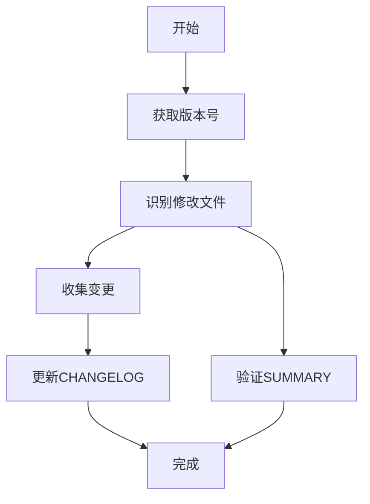

# 更新变更日志工作流程

## 执行步骤

1. 获取当前版本号
   - 使用read_file读取.clinerules/version.md

2. 识别修改的文件
   - 使用execute_command执行git status --porcelain
   - 解析输出获取修改的文件路径

3. 收集变更内容
   - 对每个修改的文件：
     - 使用read_file读取文件内容
     - 检查是否有CHANGELOG部分
     - 若无，使用execute_command执行git diff获取变更
     - 总结变更内容

4. 更新文件变更日志
   - 使用write_to_file将变更添加到文件CHANGELOG部分
   - 版本日志按倒序排列

5. 更新主CHANGELOG.md
   - 使用write_to_file添加汇总变更
   - 按当前版本分类组织

6. 验证SUMMARY.md
   - 使用read_file检查文件是否在正确位置
   - 如需更新，使用write_to_file修改

## 注意事项
- 变更记录格式必须一致
- SUMMARY.md验证要点：
  - 文件路径正确
  - 分类层级正确
  - 链接格式一致
- 使用完整文件路径
- 每次工具调用后确认执行结果
