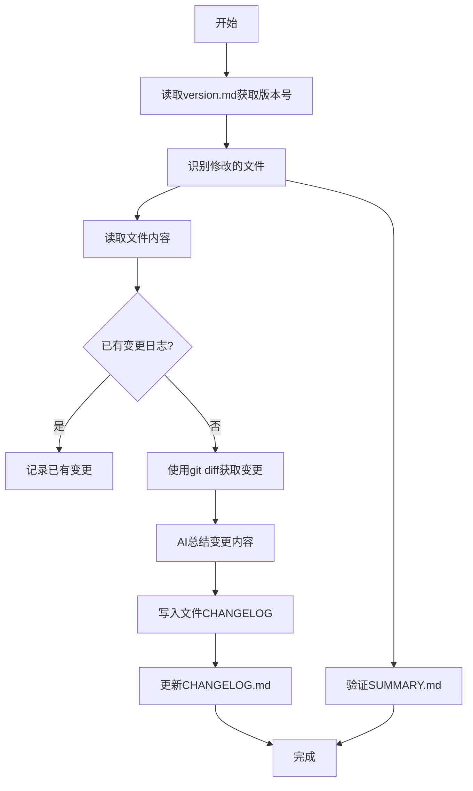

# 更新变更日志工作流程



## 详细分步指南

1. **获取当前版本**
   - 使用read_file工具读取.clinerules/version.md
   - 示例function call:
     ```xml
     <read_file>
     <path>.clinerules/version.md</path>
     </read_file>
     ```

2. **识别修改的文件**
   - 使用execute_command执行git status
   - 示例function call:
     ```xml
     <execute_command>
     <command>git status --porcelain</command>
     <requires_approval>false</requires_approval>
     </execute_command>
     ```
   - 解析输出获取修改的文件路径

3. **读取文件内容**
   ```xml
   <read_file>
   <path>src/天赋/兔子脚.md</path>
   </read_file>
   ```

4. **检查已有变更日志**
   - 如果文件已有完整的变更日志，直接记录
   - 示例已有变更格式：
     ```
     ## CHANGELOG
     
     - [1.1.7] 修改了触发条件
     - [1.1.6] 新增了特殊效果
     ```

5. **使用git diff获取变更(若无日志)**
   ```xml
   <execute_command>
   <command>git diff --unified=0 src/天赋/兔子脚.md</command>
   <requires_approval>false</requires_approval>
   </execute_command>
   ```
   - 解析diff输出获取具体变更

6. **AI总结变更内容**
   - 总结规则:
     - 识别新增/修改/删除的内容
     - 提取关键变更描述
     - 保持简洁一致的格式
   - 示例输出:
     ```
     - 提高了Cost数值从1→2
     - 新增了特殊效果描述
     ```

7. **写入文件CHANGELOG**
   ```xml
   <replace_in_file>
   <path>src/天赋/兔子脚.md</path>
   <diff>
   ------- SEARCH
   ## CHANGELOG
   =======
   ## CHANGELOG

   ### [1.1.7] - 2025-08-18

   - 提高了Cost数值从1→2
   - 新增了特殊效果描述
   +++++++ REPLACE

8. **更新CHANGELOG.md**
   - 首先读取CHANGELOG.md文件本身，学习并模仿历史格式
   - 使用replace_in_file工具添加变更
   - 示例:
     ```xml
     <replace_in_file>
     <path>src/CHANGELOG.md</path>
     <diff>
     ------- SEARCH
     ## [Unreleased]
     =======
     ## [Unreleased]

     ### Changed

     #### 天赋

     - [兔子脚](天赋/兔子脚.md) - 提高了Cost
     +++++++ REPLACE
     </diff>
     </replace_in_file>
     ```

9. **验证SUMMARY.md**
   - 使用read_file读取SUMMARY.md内容
   - 检查修改的文件是否在正确分类下
   - 验证规则：
     - 文件路径必须完全匹配
     - 分类层级必须正确  
     - 链接格式必须一致
     - 新增文件必须添加对应条目
     - 重命名文件需更新旧路径
   - 注意，SUMMARY是格式化的，类似python前导空白数量是语义的一部分，不可缺少
   - 示例验证function call:
     ```xml
     <read_file>
     <path>src/SUMMARY.md</path>
     </read_file>
     ```
   - 如需更新，使用replace_in_file修改。如果不需要更新，则直接结束这一步骤

## 注意事项
1. 必须从.clinerules/version.md获取版本号
2. 每个function调用后需确认执行结果
3. 变更记录格式必须严格一致
4. SUMMARY验证要点：
   - 检查文件是否在正确的分类下
   - 确认路径大小写一致
   - 验证Markdown链接格式
   - 确保没有重复条目
5. 使用完整文件路径
6. 确保SEARCH/REPLACE块格式正确
