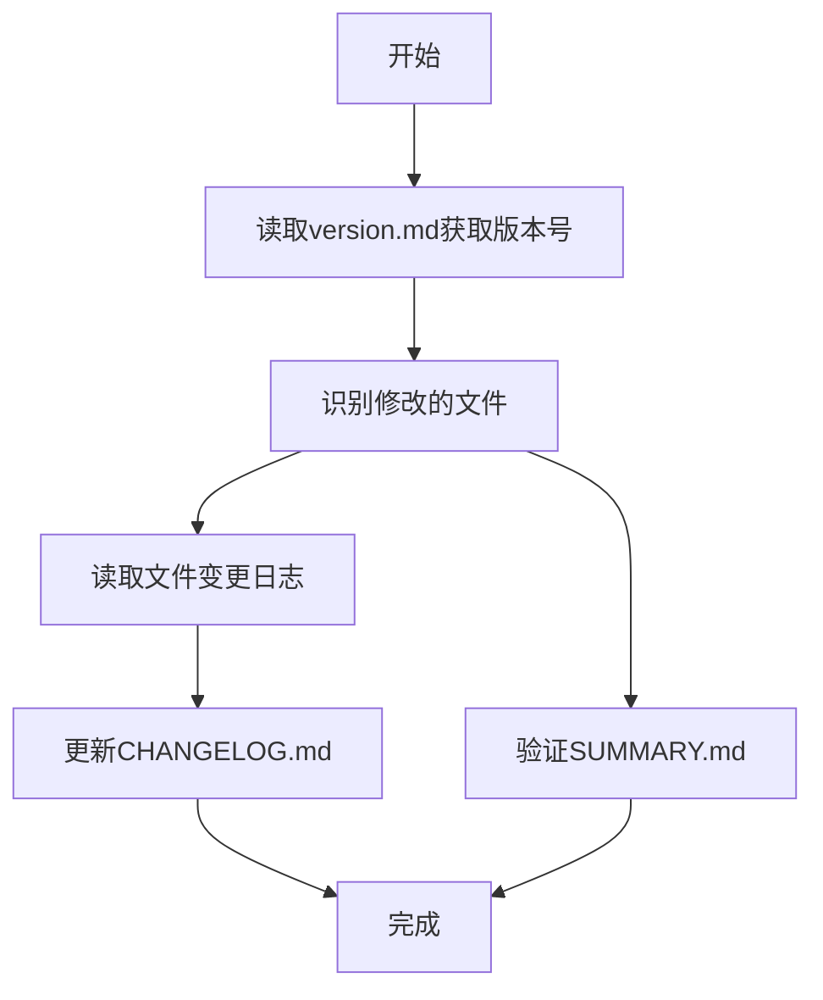

# 更新变更日志工作流程



## 详细分步指南

1. **获取当前版本**
   - 使用read_file工具读取.clinerules/version.md
   - 示例function call:
     ```xml
     <read_file>
     <path>.clinerules/version.md</path>
     </read_file>
     ```

2. **识别修改的文件**
   - 使用execute_command执行git status
   - 示例function call:
     ```xml
     <execute_command>
     <command>git status --porcelain</command>
     <requires_approval>false</requires_approval>
     </execute_command>
     ```
   - 解析输出获取修改的文件路径
   - 过滤出包含CHANGELOG的文件

3. **提取变更日志**
   - 对每个修改的文件使用read_file
   - 示例:
     ```xml
     <read_file>
     <path>src/天赋/兔子脚.md</path>
     </read_file>
     ```
   - 在文件内容中查找"CHANGELOG"部分

4. **更新CHANGELOG.md**
   - 使用replace_in_file工具添加变更
   - 示例:
     ```xml
     <replace_in_file>
     <path>src/CHANGELOG.md</path>
     <diff>
     ------- SEARCH
     ## [Unreleased]
     =======
     ## [Unreleased]

     ### Changed

     #### 天赋

     - [兔子脚](天赋/兔子脚.md) - 提高了Cost
     +++++++ REPLACE
     </diff>
     </replace_in_file>
     ```

5. **验证SUMMARY.md**
   - 使用read_file读取SUMMARY.md内容
   - 检查修改的文件是否在正确分类下
   - 验证规则：
     - 文件路径必须完全匹配
     - 分类层级必须正确
     - 链接格式必须一致
   - 示例验证function call:
     ```xml
     <read_file>
     <path>src/SUMMARY.md</path>
     </read_file>
     ```
   - 如需更新，使用replace_in_file修改

## 注意事项
1. 必须从.clinerules/version.md获取版本号
2. 每个function调用后需确认执行结果
3. 变更记录格式必须严格一致
4. SUMMARY验证要点：
   - 检查文件是否在正确的分类下
   - 确认路径大小写一致
   - 验证Markdown链接格式
   - 确保没有重复条目
5. 使用完整文件路径
6. 确保SEARCH/REPLACE块格式正确
